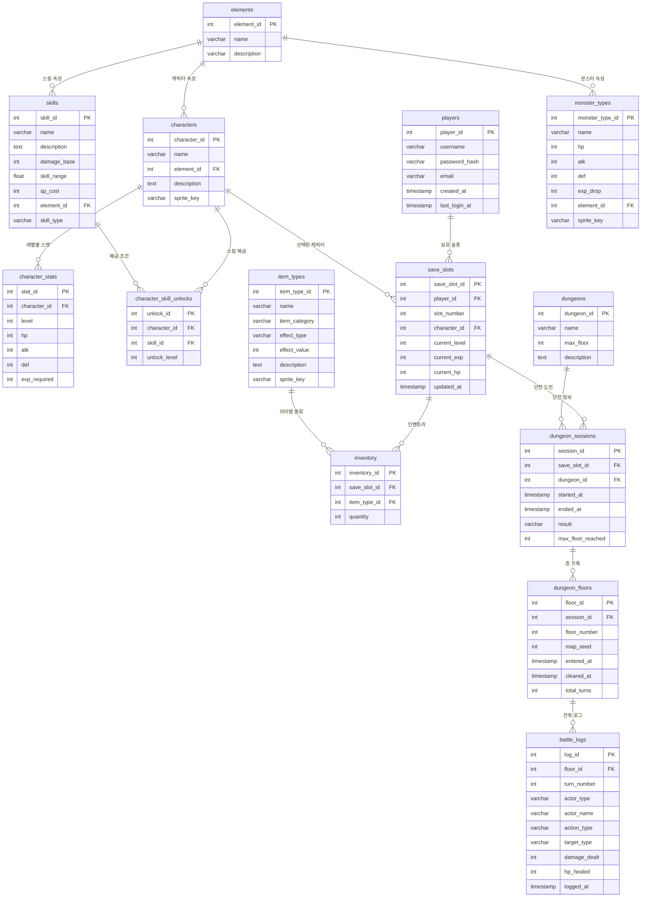

# Artesia — 데이터베이스 설계

## 1. DB 선택 근거

| 항목 | 선택 | 이유 |
|------|------|------|
| **서버 DB** | **PostgreSQL** | JSONB 지원(전투 로그 확장), 강력한 제약 조건, 무료 오픈소스 |
| **로컬/임베디드** | **SQLite** | Unity 내장 가능, 현재 JSON 파일 저장을 DB로 대체 |

> 현재 게임은 로컬 JSON(`SaveData1~3.json`) + CSV(캐릭터 스탯)로 데이터를 관리합니다.  
> 이 설계는 **서버 백엔드 확장** 또는 **멀티플레이 지원**을 목표로 합니다.

---

## 2. ERD (Mermaid)



---

## 3. 테이블 상세 설명

### 마스터 데이터 (Master Data)

| 테이블 | 설명 | 데이터 예시 |
|--------|------|-------------|
| `elements` | 속성 종류 | 공허, 화염, 냉기, 번개 |
| `characters` | 플레이어블 캐릭터 종류 | 레이나 |
| `character_stats` | 캐릭터 레벨별 스탯 (현재 CSV) | 레이나 Lv5: HP50, ATK10, DEF5 |
| `skills` | 스킬 정의 | 칼날 회오리: 데미지 15, 범위 1.0 |
| `character_skill_unlocks` | 캐릭터가 배울 수 있는 스킬과 해금 레벨 | 레이나 Lv5 → 칼날 회오리 |
| `monster_types` | 몬스터 종류 | 보이드 리퍼: HP25, ATK5, EXP8 |
| `item_types` | 아이템 종류 | 포션: HEAL_HP, 효과값 10 |
| `dungeons` | 던전 정의 | 그림자 궤도: 최대 5층 |

### 유저 데이터 (User Data)

| 테이블 | 설명 | 비고 |
|--------|------|------|
| `players` | 플레이어 계정 | 로그인/회원가입 |
| `save_slots` | 세이브 슬롯 1~3 | `(player_id, slot_number)` 유니크 |
| `inventory` | 슬롯별 보유 아이템 | 수량 포함 |

### 플레이 기록 (Play Records)

| 테이블 | 설명 | 비고 |
|--------|------|------|
| `dungeon_sessions` | 던전 1회 도전 기록 | result: IN_PROGRESS / CLEARED / DEAD |
| `dungeon_floors` | 층별 기록 | BSP 시드, 소요 턴 수 |
| `battle_logs` | 턴별 행동 기록 | actor_type: PLAYER / MONSTER |

---

## 4. DDL (PostgreSQL)

```sql
-- ============================================================
-- 마스터 데이터
-- ============================================================

CREATE TABLE elements (
    element_id   SERIAL PRIMARY KEY,
    name         VARCHAR(50)  NOT NULL UNIQUE,   -- 공허, 화염, 냉기 ...
    description  TEXT
);

CREATE TABLE characters (
    character_id  SERIAL PRIMARY KEY,
    name          VARCHAR(100) NOT NULL UNIQUE,   -- 레이나
    element_id    INT REFERENCES elements(element_id),
    description   TEXT,
    sprite_key    VARCHAR(255)                    -- Resources 경로 키
);

CREATE TABLE character_stats (
    stat_id       SERIAL PRIMARY KEY,
    character_id  INT NOT NULL REFERENCES characters(character_id) ON DELETE CASCADE,
    level         INT NOT NULL,
    hp            INT NOT NULL,
    atk           INT NOT NULL,
    def           INT NOT NULL,
    exp_required  INT NOT NULL,                  -- 이 레벨에서 다음 레벨로 필요한 EXP
    UNIQUE (character_id, level)
);

CREATE TABLE skills (
    skill_id      SERIAL PRIMARY KEY,
    name          VARCHAR(100) NOT NULL,          -- 칼날 회오리
    description   TEXT,
    damage_base   INT          NOT NULL DEFAULT 0,
    skill_range   FLOAT        NOT NULL DEFAULT 1.0,
    sp_cost       INT          NOT NULL DEFAULT 0,
    element_id    INT REFERENCES elements(element_id),
    skill_type    VARCHAR(20)  NOT NULL DEFAULT 'ACTIVE' -- ACTIVE | PASSIVE
);

CREATE TABLE character_skill_unlocks (
    unlock_id     SERIAL PRIMARY KEY,
    character_id  INT NOT NULL REFERENCES characters(character_id) ON DELETE CASCADE,
    skill_id      INT NOT NULL REFERENCES skills(skill_id) ON DELETE CASCADE,
    unlock_level  INT NOT NULL,
    UNIQUE (character_id, skill_id)
);

CREATE TABLE monster_types (
    monster_type_id  SERIAL PRIMARY KEY,
    name             VARCHAR(100) NOT NULL,       -- 보이드 리퍼
    hp               INT          NOT NULL,
    atk              INT          NOT NULL,
    def              INT          NOT NULL DEFAULT 0,
    exp_drop         INT          NOT NULL,
    element_id       INT REFERENCES elements(element_id),
    sprite_key       VARCHAR(255)
);

CREATE TABLE item_types (
    item_type_id   SERIAL PRIMARY KEY,
    name           VARCHAR(100) NOT NULL,
    item_category  VARCHAR(20)  NOT NULL,         -- POTION | EQUIPMENT | CONSUMABLE
    effect_type    VARCHAR(50),                   -- HEAL_HP | BOOST_ATK | BOOST_DEF
    effect_value   INT,
    description    TEXT,
    sprite_key     VARCHAR(255)
);

CREATE TABLE dungeons (
    dungeon_id    SERIAL PRIMARY KEY,
    name          VARCHAR(100) NOT NULL UNIQUE,   -- 그림자 궤도
    max_floor     INT          NOT NULL,
    description   TEXT
);

-- ============================================================
-- 유저 데이터
-- ============================================================

CREATE TABLE players (
    player_id      SERIAL PRIMARY KEY,
    username       VARCHAR(100) NOT NULL UNIQUE,
    password_hash  VARCHAR(255) NOT NULL,
    email          VARCHAR(255) UNIQUE,
    created_at     TIMESTAMPTZ  NOT NULL DEFAULT NOW(),
    last_login_at  TIMESTAMPTZ
);

CREATE TABLE save_slots (
    save_slot_id   SERIAL PRIMARY KEY,
    player_id      INT          NOT NULL REFERENCES players(player_id) ON DELETE CASCADE,
    slot_number    INT          NOT NULL CHECK (slot_number BETWEEN 1 AND 3),
    character_id   INT          NOT NULL REFERENCES characters(character_id),
    current_level  INT          NOT NULL DEFAULT 1,
    current_exp    INT          NOT NULL DEFAULT 0,
    current_hp     INT,
    updated_at     TIMESTAMPTZ  NOT NULL DEFAULT NOW(),
    UNIQUE (player_id, slot_number)
);

CREATE TABLE inventory (
    inventory_id   SERIAL PRIMARY KEY,
    save_slot_id   INT          NOT NULL REFERENCES save_slots(save_slot_id) ON DELETE CASCADE,
    item_type_id   INT          NOT NULL REFERENCES item_types(item_type_id),
    quantity       INT          NOT NULL DEFAULT 1 CHECK (quantity >= 0),
    UNIQUE (save_slot_id, item_type_id)
);

-- ============================================================
-- 플레이 기록
-- ============================================================

CREATE TABLE dungeon_sessions (
    session_id         SERIAL PRIMARY KEY,
    save_slot_id       INT         NOT NULL REFERENCES save_slots(save_slot_id) ON DELETE CASCADE,
    dungeon_id         INT         NOT NULL REFERENCES dungeons(dungeon_id),
    started_at         TIMESTAMPTZ NOT NULL DEFAULT NOW(),
    ended_at           TIMESTAMPTZ,
    result             VARCHAR(20) NOT NULL DEFAULT 'IN_PROGRESS', -- IN_PROGRESS | CLEARED | DEAD
    max_floor_reached  INT         NOT NULL DEFAULT 0
);

CREATE TABLE dungeon_floors (
    floor_id       SERIAL PRIMARY KEY,
    session_id     INT         NOT NULL REFERENCES dungeon_sessions(session_id) ON DELETE CASCADE,
    floor_number   INT         NOT NULL,
    map_seed       INT,                          -- BSP 생성 시드 (맵 재현용)
    entered_at     TIMESTAMPTZ NOT NULL DEFAULT NOW(),
    cleared_at     TIMESTAMPTZ,
    total_turns    INT         NOT NULL DEFAULT 0
);

CREATE TABLE battle_logs (
    log_id         SERIAL PRIMARY KEY,
    floor_id       INT         NOT NULL REFERENCES dungeon_floors(floor_id) ON DELETE CASCADE,
    turn_number    INT         NOT NULL,
    actor_type     VARCHAR(10) NOT NULL,         -- PLAYER | MONSTER
    actor_name     VARCHAR(100),                 -- 레이나 | 보이드 리퍼
    action_type    VARCHAR(20) NOT NULL,         -- MOVE | ATTACK | SKILL | ITEM | LEVELUP
    target_type    VARCHAR(10),                  -- PLAYER | MONSTER
    damage_dealt   INT         NOT NULL DEFAULT 0,
    hp_healed      INT         NOT NULL DEFAULT 0,
    logged_at      TIMESTAMPTZ NOT NULL DEFAULT NOW()
);

-- ============================================================
-- 초기 마스터 데이터 삽입
-- ============================================================

INSERT INTO elements (name, description) VALUES
    ('공허', '공허 속성 — 보이드 계열 데미지'),
    ('화염', '화염 속성'),
    ('냉기', '냉기 속성'),
    ('번개', '번개 속성');

INSERT INTO characters (name, element_id, description, sprite_key) VALUES
    ('레이나', 1, '공허 속성을 다루는 주인공', 'Player/Reina');

INSERT INTO character_stats (character_id, level, hp, atk, def, exp_required)
SELECT 1, lv, hp, atk, def, exp
FROM (VALUES
    (1,  10, 5, 2,  20),
    (2,  15, 6, 3,  35),
    (3,  20, 7, 3,  55),
    (4,  28, 8, 4,  80),
    (5,  38, 9, 5, 100),
    (6,  50,10, 6, 130),
    (7,  65,11, 7, 165),
    (8,  82,12, 8, 205),
    (9, 101,13, 9, 250),
    (10,123,15,10, 300)
) AS t(lv, hp, atk, def, exp);

INSERT INTO skills (name, description, damage_base, skill_range, sp_cost, element_id, skill_type) VALUES
    ('칼날 회오리', '주변 적에게 공허 데미지를 입힌다', 15, 1.0, 0, 1, 'ACTIVE');

INSERT INTO character_skill_unlocks (character_id, skill_id, unlock_level) VALUES
    (1, 1, 5);

INSERT INTO monster_types (name, hp, atk, def, exp_drop, element_id, sprite_key) VALUES
    ('보이드 리퍼', 25, 5, 0, 8, 1, 'Monster/VoidReaper');

INSERT INTO item_types (name, item_category, effect_type, effect_value, description, sprite_key) VALUES
    ('포션', 'POTION', 'HEAL_HP', 10, 'HP를 10 회복한다', 'Image/Potion');

INSERT INTO dungeons (name, max_floor, description) VALUES
    ('그림자 궤도', 5, '우주 궤도를 따라 펼쳐지는 첫 번째 던전');
```

---

## 5. 엔티티 관계 요약

```
players (1) ──── (N) save_slots
                       │
               ┌───────┼────────────────────────┐
               │       │                        │
          characters  inventory           dungeon_sessions
               │    (N item_types)              │
       ┌───────┤                        dungeon_floors
       │       │                                │
character_stats │                         battle_logs
       │       │
character_skill_unlocks
               │
            skills
               │
           elements ──── monster_types
                    ──── characters
                    ──── skills
```

---

## 6. 현재 코드 → DB 매핑

| 현재 (Unity 로컬) | DB 테이블 | 비고 |
|-------------------|-----------|------|
| `Data.cs` — `MainPlayCharacterName, nowLv, nowExp` | `save_slots` | 슬롯별 저장 |
| `SaveData1~3.json` | `save_slots.slot_number 1~3` | JSON → DB 행 |
| `레이나Stat.csv` | `character_stats` | CSV → DB 마이그레이션 |
| `PlayerStat` — HP, ATK, DEF, EXP, Element | `character_stats` + `characters` | 레벨별 분리 |
| `MobStat` — HP=25, ATK=5, EXP=8 | `monster_types` | 보이드 리퍼 |
| `PotionStat` — HP=10 | `item_types` | HEAL_HP 효과 |
| `PlayerSkill` — 칼날 회오리, damage=15, range=1.0 | `skills` | |
| `GameManager.dungeonName` = "그림자 궤도", `stageMaxFloor`=5 | `dungeons` | |
| `BattleManager` 로그 메시지 | `battle_logs` | 구조화된 행으로 저장 |
| `TurnManager.stageIndex` | `dungeon_floors.floor_number` | |

---

## 7. 확장 고려사항

### 속성 상성 테이블 (미구현 → 추후 추가)
```sql
CREATE TABLE element_affinities (
    attacker_element_id  INT NOT NULL REFERENCES elements(element_id),
    defender_element_id  INT NOT NULL REFERENCES elements(element_id),
    multiplier           NUMERIC(4,2) NOT NULL DEFAULT 1.00,  -- 1.5=강함, 0.5=약함
    PRIMARY KEY (attacker_element_id, defender_element_id)
);
```

### 보조 캐릭터 (Data.cs 주석 → 미구현)
```sql
ALTER TABLE save_slots ADD COLUMN sub_character_id INT REFERENCES characters(character_id);
```

### 장비 아이템 (미구현)
```sql
CREATE TABLE equipment_slots (
    slot_id       SERIAL PRIMARY KEY,
    save_slot_id  INT NOT NULL REFERENCES save_slots(save_slot_id),
    slot_type     VARCHAR(20) NOT NULL,  -- WEAPON | ARMOR | ACCESSORY
    item_type_id  INT REFERENCES item_types(item_type_id)
);
```
